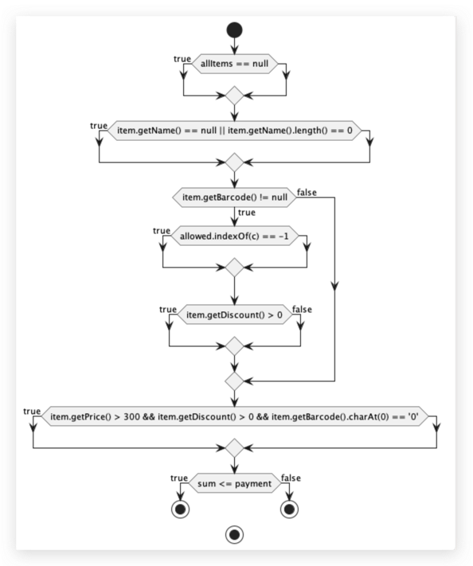

# Втора лабораториска вежба по Софтверско инженерство 2023/24

## Кристијан Цветковиќ, 121002

#

###  Control Flow Graph



#

### Цикломатска комплексност

Цикломатската комплексност на овој код е 8, истата ја добив преку формулата D+1, каде што D е бројот на одлуки. Во случајoв D=7, па цикломатската комплексност изнесува 8.

#

### Тест случаи според критериумот Every branch
Ги проверуваме сите тест случаи каде имаме еден условен израз или циклус и ги проверуваме излезите со true и false.

#### Тест случај 1: allItems e null

Опис: Овој тест случај го проверува однесувањето кога листата allItems е null. Ја покрива одлучната гранка каде RuntimeException е фрлен со пораката "allItems list can't be null!".

#### Тест случај 2: allItems e празно

Опис: Овој тест случај го проверува однесувањето кога листата allItemsе празна. Ја покрива одлучната гранка каде методот враќа точно бидејќи сумата е 0, и наплатата е доволна.

#### Тест случај 3: Item името е null или празно

Опис: Овој тест случај го проверува однесувањето кога еден item во листата allItems има null или празно name. Ја покрива одлучната гранка каде името на item-от e поставено како "unknown".

#### Тест случај 4: Item баркодот е null

Опис: Овој тест случај го проверува однесувањето кога еден  item во листата allItems има null баркод. Ја покрива одлучната гранка каде RuntimeException е фрлен со пораката "No barcode!".

#### Тест случај 5: Item баркодот има невалидни карактери

Опис: Овој тест случај го проверува однесувањето на еден item во листата allItems што има баркод со невалидни карактери, односно не се броеви. Ја покрива одлучната гранка каде RuntimeException е фрлен со пораката "Invalid character in item barcode!".

#### Тест случај 6: Item со попуст

Опис: Овој тест случај го проверува однесувањето на еден item во листата allItems со попуст. Ја покрива одлучната гранка каде цената од попустот е пресметана во сумата.

#### Тест случај 7: Item без попуст

Опис: Овој тест случај го проверува однесувањето на еден item во листата allItems што нема попуст. Ја покрива одлучната гранка каде целата цена е додадена во сумата.

#### Тест случај 8: Item со цена > 300, попуст > 0, и barcode што почнува со '0'

Опис: Овој тест случај го проверува однесувањето на еден item во листата allItems што има цена поголема од 300, попуст поголем од 0, и баркодот почнува со '0'. Ја покрива одлучната гранка каде 30 е одземено од сумата.

#### Тест случај 9: Наплатата е доволна

Опис: Овој тест случај го проверува однесувањето кога вредноста на наплатата е доволна да ја покрие сумата на сите елементи во листата allItems. Ја покрива одлучната гранка каде методот враќа true.

#### Тест случај 10: Наплатата не е доволна

Опис: Овој тест случај го проверува однесувањето кога вредноста на наплатата не доволна да ја покрие сумата на сите елементи во листата allItems. Ја покрива одлучната гранка каде методот враќа false.

#

### Тест случаи според критериумот Multiple Condition
За да ги покриеме тест случаите за 
```
if (item.getPrice() > 300 && item.getDiscount() > 0 && item.getBarcode().charAt(0) == '0').
```
треба да ги покриеме трите комбинации што можат индивидуално да се тестираат, односно вкупно 2^n = 8 комбинации, каде n = 3.

#### Тест Случај 1: Сите услови се true

Опис: Овој тест случај го покрива сценариото каде item.getPrice() > 300 е true, item.getDiscount() > 0 е true, и item.getBarcode().charAt(0) == '0' е true. Ја покрива гранката каде условот е true, и 30 е одземено од сумата.

#### Тест Случај 2: Сите услови се false

Опис: Овој тест случај го покрива сценариото каде item.getPrice() > 300 е false, item.getDiscount() > 0 е false, и item.getBarcode().charAt(0) == '0' е false. Ја покрива гранката каде условот е false, и нема одземање од сумата.

#### Тест Случај 3: Првиот услов е true, другите се false

Опис: Овој тест случај го покрива сценариото каде item.getPrice() > 300 е true, item.getDiscount() > 0 е false, и item.getBarcode().charAt(0) == '0' е false. Ја покрива гранката каде условот е false, и нема одземање од сумата.

#### Тест Случај 4: Вториот услов е true, другите се false

Опис: Овој тест случај го покрива сценариото каде item.getPrice() > 300 е false item.getDiscount() > 0 е true, и item.getBarcode().charAt(0) == '0' е false. Ја покрива гранката каде условот е false, и нема одземање од сумата.

#### Тест Случај 5: Третиот услов е true, другите се false

Опис: Овој тест случај го покрива сценариото каде item.getPrice() > 300 е false, item.getDiscount() > 0 е false, и item.getBarcode().charAt(0) == '0' е true. Ја покрива гранката каде условот е false, и нема одземање од сумата.

#### Тест Случај 6: Првиот и вториот услов се true, третиот е false

Опис: Овој тест случај го покрива сценариото каде item.getPrice() > 300 е true, item.getDiscount() > 0 е true, и item.getBarcode().charAt(0) == '0' е false. Ја покрива гранката каде условот е false, и нема одземање од сумата.

#### Тест Случај 7: Првиот и третиот услов се true, вториот е false

Опис: Овој тест случај го покрива сценариото каде item.getPrice() > 300 е true, item.getDiscount() > 0 е false, и item.getBarcode().charAt(0) == '0' е true. Ја покрива гранката каде условот е false, и нема одземање од сумата.

#### Тест Случај 8: Вториот и третиот услов се true, првиот е false

Опис: Овој тест случај го покрива сценариото каде item.getPrice() > 300 е false, item.getDiscount() > 0 е true, и item.getBarcode().charAt(0) == '0' е true. Ја покрива гранката каде условот е false, и нема одземање од сумата.

### Објаснување на напишаните unit tests
Користиме @ParameterizedTest за да ни помогне со тестирање на повеќе параметризирани inputs. Во првиот тест ги користиме тест случаевите од Every Branch критериумот и ги задаваме како аргументи во checkCart методот.
Исто и за Multiple Condition критериумот, користиме параметризиран input за да ги покриеме сите случаеви.
